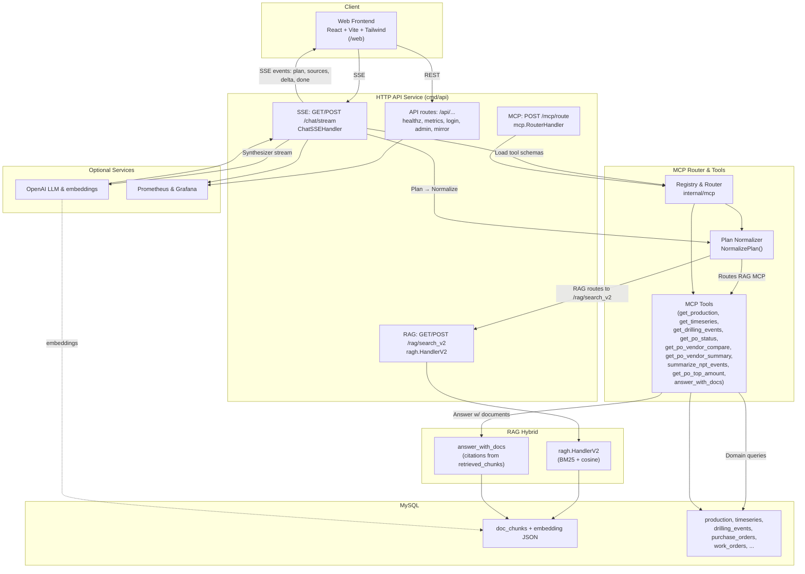

# MCP RAG Proof of Concept — Oil & Gas Prototype

Proyek ini adalah Proof of Concept **Multi Context Protocol (MCP) dan Retrieval-Augmented Generation (RAG)** untuk industri migas.  
Aplikasi ini menghubungkan berbagai sumber internal domain (drilling, production, HSSE, purchase order, timeseries, dan RAG search) ke dalam satu router, sehingga query dari client bisa diarahkan otomatis ke service/repository yang tepat.

---

## Apa itu MCP?
**Multi Context Protocol (MCP)** adalah protokol untuk menghubungkan LLM dengan berbagai tools atau services di belakang layar.  
Dengan MCP, pertanyaan user bisa otomatis dipetakan ke domain tertentu (misalnya drilling events, purchase orders, atau RAG search) lalu dieksekusi dengan cara paling tepat.

## Apa itu RAG?
**Retrieval-Augmented Generation (RAG)** adalah teknik menggabungkan kemampuan LLM dengan pencarian berbasis dokumen.  
Alih-alih hanya mengandalkan model, RAG mengambil potongan teks relevan dari database (misalnya `doc_chunks`), lalu menggunakannya untuk menghasilkan jawaban yang lebih akurat dan bersitasi.

---

## 🛑 Problem

Di industri migas, data operasional tersebar di banyak domain dan sistem terpisah:
- **Drilling** → laporan pengeboran & NPT (Non Productive Time).
- **Production** → data produksi harian & timeseries.
- **HSSE** → catatan insiden & laporan keselamatan.
- **Purchase Order** → status pembelian & vendor.
- **Dokumen teknis** → file PDF/Word yang terpecah di berbagai departemen.

Akibatnya, untuk menjawab satu pertanyaan sederhana (misalnya *"berapa banyak insiden HSSE di rig B07 bulan ini?"*), user harus:
- Menghubungi beberapa tim/departemen.  
- Mencari file laporan manual.  
- Menunggu validasi & rekap data.  

Proses ini bisa memakan waktu **berhari-hari** dan rentan inkonsistensi antar sumber.

---

## ✅ Solusi

Proyek **MCP + RAG** ini menawarkan pendekatan modern:
- **MCP Router** → bertindak sebagai *smart gateway* yang mengarahkan pertanyaan user ke domain/data repository yang tepat (drilling, production, HSSE, PO, timeseries).  
- **RAG Search** → menggabungkan *keyword search (BM25)* dan *semantic search (cosine similarity)* untuk mengambil potongan dokumen paling relevan.  
- **LLM Integration** → query natural language dari user dipahami & dijawab dengan konteks, lengkap dengan sitasi dari dokumen sumber.  
- **Chat SSE** → jawaban dikirim secara *streaming* sehingga interaktif, mirip chat dengan asisten AI.  

### Dampak bagi perusahaan migas:
- ⏱ **Lebih cepat** → jawaban lintas domain dalam hitungan detik.  
- 📊 **Lebih akurat** → jawaban berbasis dokumen & sitasi, mudah diverifikasi.  
- 🔄 **Lebih efisien** → kurangi beban koordinasi antar departemen.  
- 🧩 **Lebih fleksibel** → mudah diperluas dengan tools/domain tambahan sesuai kebutuhan bisnis.  
.  
---
---
[](https://youtu.be/l2L5o9zz7Os)
---

---

Project : MCP_RAG (Oil & Gas) — Go
Version : 0.1.0
Author : Kukuh Tripamungkas Wicaksono (Kukuh TW)

Email : kukuhtw@gmail.com

WhatsApp: https://wa.me/628129893706

Linkedin: https://www.linkedin.com/in/kukuhtw/

License : MIT (see LICENSE)

### Summary
Monorepo PoC MCP + RAG untuk studi kasus perusahaan migas.  
Fitur utama:  
- MCP Router & Tools (PO, Production, Drilling, Timeseries, NPT).  
- RAG hybrid (BM25 + cosine) via `/rag/search_v2` (MySQL doc_chunks).  
- Jawaban berbasis dokumen (`answer_with_docs`) lengkap sitasi.  
- Chat SSE (`/chat/stream`): planning → normalize → execute → stream.  
- Plan normalizer (auto switch rag_search_v2, top-N PO by amount).  
- Domain REST endpoints siap pakai.  
- Konfigurasi via ENV; dukung OpenAI untuk LLM/embeddings (opsional).  

---

## Isi Singkat

* [Struktur Proyek](#struktur-proyek)
* [Fitur Utama](#fitur-utama)
* [Quickstart](#quickstart)
* [Konfigurasi Lingkungan](#konfigurasi-lingkungan)
* [Endpoint Penting](#endpoint-penting)
* [Arsitektur & Alur Chat SSE](#arsitektur--alur-chat-sse)
* [Normalisasi Rencana (Planner)](#normalisasi-rencana-planner)
* [Contoh Pertanyaan](#contoh-pertanyaan)
* [Troubleshooting](#troubleshooting)
* [Lisensi](#lisensi)
* [Kredit](#kredit)



---

## Fitur Utama

* **MCP Router & Tools**: `get_production`, `get_timeseries`, `get_drilling_events`, `get_po_status`, `get_po_vendor_compare`, `get_po_vendor_summary`, `summarize_npt_events`, `answer_with_docs`, `get_po_top_amount` (Top-N by amount).
* **RAG Hybrid**: Endpoint `/rag/search_v2` memakai MySQL (BM25 + cosine) langsung pada `doc_chunks.embedding (JSON)`.
* **Answer With Docs**: Jawaban mengutip dokumen dengan sitasi (`DOC-XXXX#pY`).
* **Chat SSE**: Endpoint `/chat/stream` → plan (LLM) → **NormalizePlan** → eksekusi routes (MCP/RAG) → stream jawaban.
* **Plan Normalizer**:

  * Rewrites route **rag** → tool `rag_search_v2` (payload `{query, top_k, alpha}`).
  * Fallback dari `detect_anomalies` ke RAG jika payload salah tapi pertanyaan bernuansa dokumen.
  * Perbaikan otomatis kasus **Top-N PO by amount** → pakai `get_po_top_amount`.
* **Observability**: `/metrics`, `/healthz`, log terstruktur.

---

## Quickstart

### 1) Prasyarat

* Go 1.22+
* MySQL 8+
* Node.js 18+ (untuk FE)

### 2) Setup DB

```bash
cp .env.example .env   # sesuaikan kredensial DB & API key jika perlu

./scripts/migrate.sh   # migrasi schema
./scripts/seed.sh      # (opsional) muat data contoh
```

### 3) Jalankan Service

```bash
# API utama (HTTP)
make build
make gen-data
make demo-data
make ingest-docs
```

### 4) Jalankan Frontend

```bash

# Akses http://localhost:5173
```

---

## Konfigurasi Lingkungan

Contoh variabel `.env`:

```env
# Database
DB_DSN="user:pass@tcp(localhost:3306)/mcp_oilgas?parseTime=true"

# JWT / Admin
ADMIN_JWT_SECRET="supersecret"

# LLM (opsional)
OPENAI_API_KEY="sk-..."

# Planner
MCP_SCHEMAS_DIR="schemas/mcp"
PLAN_MAX_ROUTES=8
```

> Tanpa `OPENAI_API_KEY`, sistem tetap berjalan (RAG hybrid & fallback extractive untuk answer\_with\_docs).

---

## Endpoint Penting

* **Health & Metrics**

  * `GET /healthz`, `GET /readyz`, `GET /metrics`
* **Chat SSE**

  * `GET|POST /chat/stream?q=...` (SSE events: `plan`, `sources`, `delta`, `done`, dll.)
* **MCP Router (HTTP-internal)**

  * `POST /mcp/route` (terima plan atau pertanyaan untuk auto-pilih tool)
* **RAG Hybrid**

  * `GET|POST /rag/search_v2` → body `{"query":"...","top_k":10,"alpha":0.6}`
    *Respon berisi `retrieved_chunks`*
* **Domain HTTP (mirror MCP)**

  * `/api/timeseries`, `/api/drilling-events`, `/api/po/status`, `/api/production`, `/api/work-orders/search`, `/api/npt/summarize`, `/api/po/vendor-compare`, `/api/answer-with-docs`, dll.

---

## Arsitektur & Alur Chat SSE

1. **Planner** (LLM JSON-mode) membaca tools dari `schemas/mcp/*.schema.json`.
2. **NormalizePlan**:

   * Rute `kind:"rag"` → **`rag_search_v2`**.
   * Perbaiki salah rute (mis. top-amount PO).
   * Tambah RAG pendukung bila relevan.
3. **ExecuteRoutes**:

   * Jalankan MCP tools in-process.
   * Jalankan RAG via closure `ragFn` (hybrid `/rag/search_v2` → fallback embeddings repo).
4. **Synthesizer**:

   * LLM stream jawaban berdasarkan `sources` (atau fallback extractive).

---

## Normalisasi Rencana (Planner)

Hal-hal yang otomatis ditangani:

* **RAG rewrite**: semua route `kind:"rag"` (termasuk tool lama `"rag"`) diubah ke tool `rag_search_v2` dengan body `{query, top_k, alpha}`.
* **Detect anomalies → RAG**: jika payload `detect_anomalies` tidak valid, dan pertanyaan tampak “berbasis dokumen”, maka dialihkan ke RAG.
* **Top-N PO by amount**: deteksi frasa seperti “top/tertinggi amount PO”, tambahkan/benarkan rute `get_po_top_amount {limit, ...}`.

---

## Contoh Pertanyaan

1. Berapa produksi  `WELL_A12` pada `2025-09-05`?
2. Bandingkan total nilai PO **status delivered** antara **SLB** dan **Weatherford** pada `2025-09-20` s/d `2025-10-06`.
3. Berikan ringkasan jumlah PO per status terbaru.
4. Bandingkan total nilai PO antara **Halliburton**, **NOV**, dan **Weatherford** periode `2025-09-01` s/d `2025-10-11`.
5. *Emergency Response Plan*.
6. *Production Forecast Q4 2025*.
7. Ambil produksi gas `WELL_E05` pada `2025-09-01`.
8. Berapa produksi `WELL_B07` pada September 2025?
9. Tampilkan produksi gas `WELL_C03` pada `2025-09-04`.
10. Ambil nilai produksi terbaru untuk `WELL_A12`.
11. Tampilkan semua event **NPT** pada `WELL_B07` selama September 2025.
12. Apa saja event drilling di `WELL_D02` pada minggu 7–13 September 2025?
13. Daftar event **NPT** di `WELL_E05` pada 3 September 2025?
14. Ambil semua drilling event di `WELL_C03` antara 24–30 September 2025.
15. Event apa saja yang terjadi di `WELL_F10` pada 10 September 2025?
16. Tampilkan **trend flow rate** `FLOW_A12` pada 1 September 2025 pukul 00:00–00:23.
17. Nilai flow rate dengan `quality=0` pada `FLOW_A12` selama 11–12 September 2025?
18. Trend perbandingan **rata-rata 5-menit** di `FLOW_A12` awal 1 Sep 2025?
19. Ada penurunan signifikan flow rate antara 14 Sep 2025 00:05–00:10 vs 00:15–00:20 di `FLOW_A12`?
20. Ambil **oil rate** `OIL_D01` untuk 18 Sep 2025 penuh (00:00–23:59).
21. Tampilkan **trend** `OIL_B07` pada minggu 15–16 Sep 2025.
22. Ambil **oil rate** `FLOW_A12` antara 06:00–12:00 pada `2025-09-01`.
23. Bandingkan flow rate `OIL_D01` vs `OIL_D02` pada 18 Sep 2025.
24. Ambil timeseries untuk `FLOW_C03`, `FLOW_E05`, `FLOW_F10` selama 3 Sep 2025, lalu tampilkan **rata-rata harian**.

---

## Troubleshooting

**1) `/chat/stream` tidak menemukan dokumen (retrieved\_chunks kosong)**

* Cek endpoint hybrid:

  ```bash
  curl "http://localhost:8080/rag/search_v2?q=Production%20Forecast%20Q4%202025"
  ```

  Pastikan respon berformat:

  ```json
  {
    "query":"...",
    "alpha":0.6,
    "count":10,
    "retrieved_chunks":[
      {"doc_id":"DOC-1005","title":"...","url":"...","page_no":3,"snippet":"...","score":0.123}
    ]
  }
  ```
* Jika struktur sudah benar namun SSE masih kosong, pastikan **NormalizePlan** aktif dan `ragFn` pada `chat_sse_handler.go` membaca `retrieved_chunks[*].page_no` (bukan `page`).

**2) Error decode saat MCP plan RAG**

* Pastikan consumer mem‐decode **objek** yang memiliki field `retrieved_chunks` (bukan langsung slice).
* Contoh decode benar (Go):

  ```go
  var resp struct {
    RetrievedChunks []struct {
      DocID string `json:"doc_id"`
      ...
    } `json:"retrieved_chunks"`
  }
  ```

**3) LLM/Embeddings tidak tersedia**

* Sistem tetap jalan: RAG hybrid + fallback extractive pada `answer_with_docs`.
  Tambahkan `OPENAI_API_KEY` untuk jawaban yang lebih natural.

**4) Observability**

* Cek `/healthz`, `/metrics`, dan log di `logs/`.

---

## Lisensi

MIT — lihat berkas `LICENSE`.

## Kredit

Dikembangkan oleh **Kukuh Tripamungkas Wicaksono (Kukuh TW)** sebagai PoC arsitektur MCP + RAG untuk domain migas.
