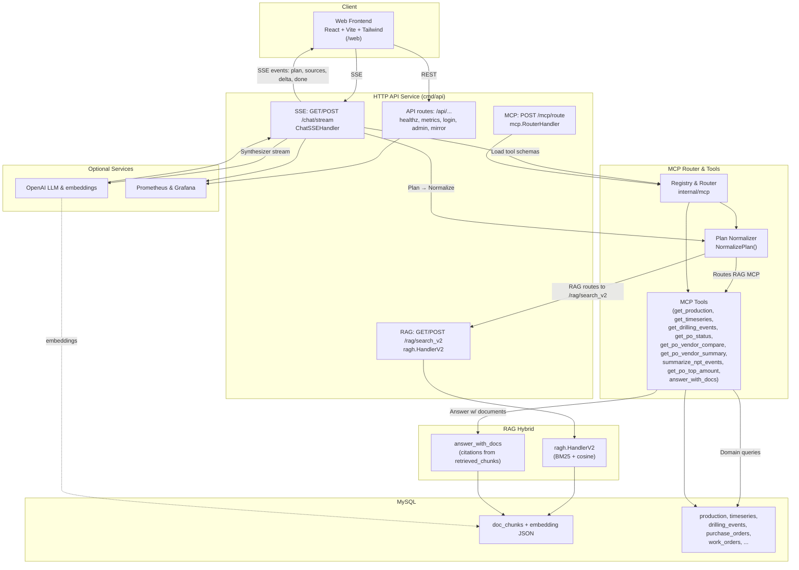

# MCP RAG Proof of Concept — Oil & Gas Prototype

This project is a Proof of Concept for **Multi Context Protocol (MCP) and Retrieval-Augmented Generation (RAG)** in the oil and gas industry.
The application connects multiple internal domains (drilling, production, HSSE, purchase orders, timeseries, and RAG search) into a single router, so client queries can be automatically routed to the right service/repository.

---

## What is MCP?

**Multi Context Protocol (MCP)** is a protocol that connects LLMs with various tools or services behind the scenes.
With MCP, a user’s question can automatically be mapped to a specific domain (e.g., drilling events, purchase orders, or RAG search) and executed in the most appropriate way.

## What is RAG?

**Retrieval-Augmented Generation (RAG)** combines the reasoning power of LLMs with document-based retrieval.
Instead of relying solely on the model, RAG fetches relevant text snippets from a database (e.g., `doc_chunks`) and uses them to produce more accurate, citation-backed answers.

---

## 🛑 The Problem

In the oil & gas industry, operational data is scattered across many domains and siloed systems:

* **Drilling** → drilling reports & Non-Productive Time (NPT).
* **Production** → daily production data & timeseries.
* **HSSE** → incident logs & safety reports.
* **Purchase Orders** → procurement status & vendor details.
* **Technical documents** → fragmented PDFs/Word files across departments.

As a result, answering a single simple question (e.g., *“How many HSSE incidents occurred on rig B07 this month?”*) requires:

* Contacting multiple teams/departments.
* Searching for reports manually.
* Waiting for validation and data consolidation.

This process can take **days** and is prone to inconsistencies between sources.

---

## ✅ The Solution

The **MCP + RAG** project offers a modern approach:

* **MCP Router** → acts as a *smart gateway* that directs user queries to the right domain/data repository (drilling, production, HSSE, PO, timeseries).
* **RAG Search** → combines *keyword search (BM25)* and *semantic search (cosine similarity)* to fetch the most relevant document chunks.
* **LLM Integration** → understands user queries in natural language and returns context-based answers, complete with citations.
* **Chat SSE** → responses are streamed interactively, like chatting with an AI assistant.

### Benefits for oil & gas companies:

* ⏱ **Faster** → cross-domain answers in seconds.
* 📊 **More accurate** → document-based answers with verifiable citations.
* 🔄 **More efficient** → reduced cross-departmental coordination burden.
* 🧩 **More flexible** → easy to extend with additional tools/domains.

---
---
[](https://youtu.be/l2L5o9zz7Os)
---
---
[](https://youtu.be/VNu7gytZr0E)
---


---

Project : MCP_RAG (Oil & Gas) — Go
Version : 0.1.0
Author : Kukuh Tripamungkas Wicaksono (Kukuh TW)

Email : kukuhtw@gmail.com

WhatsApp: https://wa.me/628129893706

Linkedin: https://www.linkedin.com/in/kukuhtw/

License : MIT (see LICENSE)
### Summary

Monorepo PoC for MCP + RAG in an oil & gas case study.
Key features:

* MCP Router & Tools (PO, Production, Drilling, Timeseries, NPT).
* Hybrid RAG (BM25 + cosine) via `/rag/search_v2` (MySQL doc\_chunks).
* Document-based answers (`answer_with_docs`) with citations.
* Chat SSE (`/chat/stream`): planning → normalize → execute → stream.
* Plan normalizer (auto-switch rag\_search\_v2, Top-N PO by amount).
* Ready-to-use REST endpoints.
* Configurable via ENV; optional OpenAI integration for LLM/embeddings.

---


---
## Table of Contents

* [Key Features](#key-features)
* [Quickstart](#quickstart)
* [Environment Configuration](#environment-configuration)
* [Important Endpoints](#important-endpoints)
* [Architecture & Chat SSE Flow](#architecture--chat-sse-flow)
* [Plan Normalization](#plan-normalization)
* [Example Questions](#example-questions)
* [Troubleshooting](#troubleshooting)
* [License](#license)
* [Credits](#credits)

---

## Key Features

* **MCP Router & Tools**: `get_production`, `get_timeseries`, `get_drilling_events`, `get_po_status`, `get_po_vendor_compare`, `get_po_vendor_summary`, `summarize_npt_events`, `answer_with_docs`, `get_po_top_amount`.
* **Hybrid RAG**: `/rag/search_v2` endpoint with MySQL (BM25 + cosine on `doc_chunks.embedding (JSON)`).
* **Answer With Docs**: responses cite documents (`DOC-XXXX#pY`).
* **Chat SSE**: `/chat/stream` → plan (LLM) → **NormalizePlan** → execute routes (MCP/RAG) → stream responses.
* **Plan Normalizer**:

  * Rewrites route **rag** → tool `rag_search_v2`.
  * Fallback from invalid `detect_anomalies` payloads to RAG if query looks doc-based.
  * Auto-corrects “Top-N PO by amount” cases → `get_po_top_amount`.
* **Observability**: `/metrics`, `/healthz`, structured logs.

---

## Quickstart

### 1) Prerequisites

* Go 1.22+
* MySQL 8+
* Node.js 18+ (for frontend)

### 2) Setup DB

```bash
make build
make gen-data
make demo-data
make ingest-docs
```

### 3) Run Service

```bash
# API server
http://localhost:8080/chat
```

### 4) Run Frontend

```bash
# Access http://localhost:5173
```

---

## Example Questions

1. What was the production of WELL_A12 on 2025-09-05?
2. Compare total PO value with status delivered between SLB and Weatherford from 2025-09-20 to 2025-10-06.
3. Summarize PO count by latest status.
4. Compare PO values for Halliburton, NOV, and Weatherford between 2025-09-01 and 2025-10-11.
5. Retrieve the Emergency Response Plan.
6. the Production Forecast Q4 2025.
7. Retrieve gas production of WELL_E05 on 2025-09-01.
8. What was WELL_B07 production in September 2025?
9. Show gas production of WELL_C03 on 2025-09-04.
10. Get the latest production value for WELL_A12.
11. List all NPT events on WELL_B07 during September 2025.
12. What drilling events occurred in WELL_D02 during the week of September 7–13, 2025?
13. List the NPT events in WELL_E05 on September 3, 2025.
14. Retrieve all drilling events in WELL_C03 between September 24–30, 2025.
15. What events occurred in WELL_F10 on September 10, 2025?
16. Show the flow rate trend for FLOW_A12 on September 1, 2025, from 00:00–00:23.
17. What are the flow rate values with quality=0 in FLOW_A12 during September 11–12, 2025?
18. Show the 5-minute average comparison trend in FLOW_A12 at the beginning of September 1, 2025.
19. Was there a significant drop in flow rate between September 14, 2025, 00:05–00:10 vs 00:15–00:20 in FLOW_A12?
20. Retrieve the oil rate OIL_D01 for September 18, 2025 (full day 00:00–23:59).
21. Show the OIL_B07 trend during September 15–16, 2025.
22. Retrieve the oil rate FLOW_A12 ,  FLOW_E05 between 06:00–12:00 on 2025-09-01.
23. Compare the flow rates OIL_D01 vs OIL_D02 on September 18, 2025.
24. Retrieve the timeseries for FLOW_C03, FLOW_E05, and FLOW_F10 during September 3, 2025, then show the daily average.

---

## License

MIT — see `LICENSE`.

💡 **Why Go (Golang)?**

* 🚀 **High performance & efficiency**
  Compiled → fast binary, minimal overhead.
  Ideal for low-latency cross-domain queries.

* ⚡ **Concurrency with goroutines**
  Handles SCADA, IoT, ERP data in parallel.

* 🛡️ **Proven stability**
  Trusted in Kubernetes, Docker, Consul.

* 📦 **Easy deployment (single binary)**
  No dependency hell, simple on-prem/private cloud migration.

* 🔄 **Supports real-time streaming (SSE)**
  Handles thousands of concurrent connections efficiently.

---

## Credits

Developed by **Kukuh Tripamungkas Wicaksono (Kukuh TW)** as a PoC architecture for MCP + RAG in the oil & gas domain.

